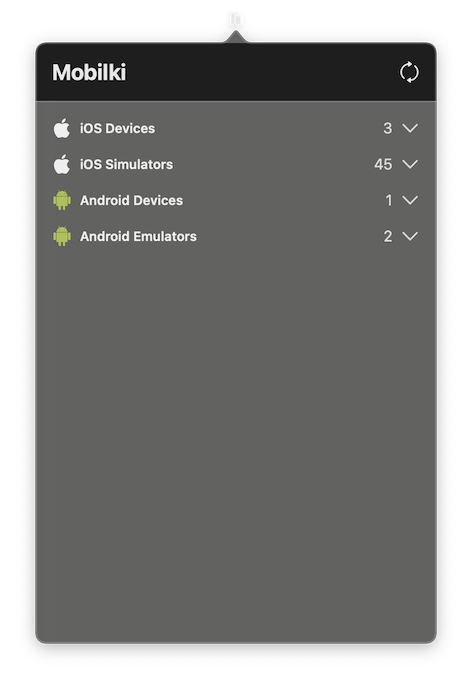

# Mobilki

A macOS menu bar app to manage iOS Simulators, Android Emulators, and real devices.

<div align="center">
  
</div>

## Features

- View connected iOS and Android devices
- Manage existing iOS Simulators and Android Emulators

## Installation

### via homebrew

```bash
git clone https://github.com/testableapple/mobilki.git && cd mobilki
brew install --cask Casks/mobilki.rb
xattr -d com.apple.quarantine /Applications/Mobilki.app
```

### or manually

```bash
git clone https://github.com/testableapple/mobilki.git && cd mobilki
open Mobilki.xcodeproj
```

## Requirements

- macOS 12.0 or later
- Xcode 14.0 or later (for iOS)
- Java, adb (for Android)

## License

This project is licensed under the terms of the MIT license. See the [LICENSE](LICENSE) file.
